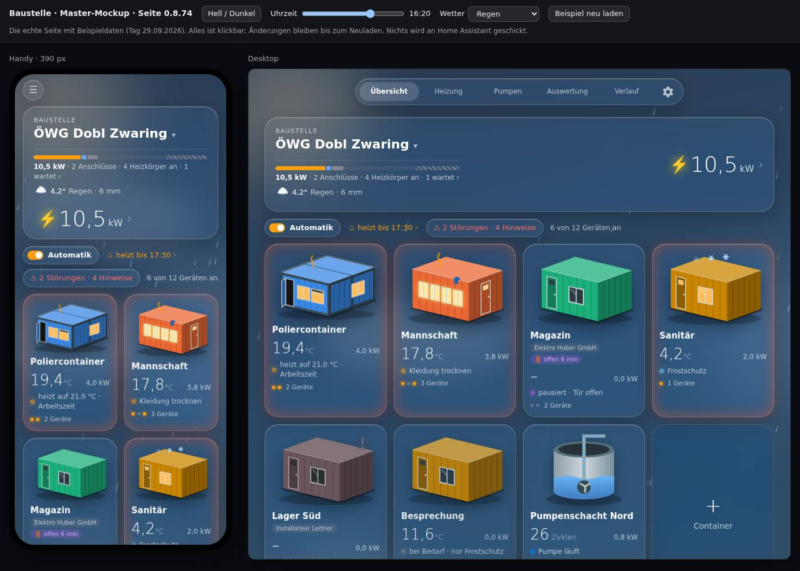
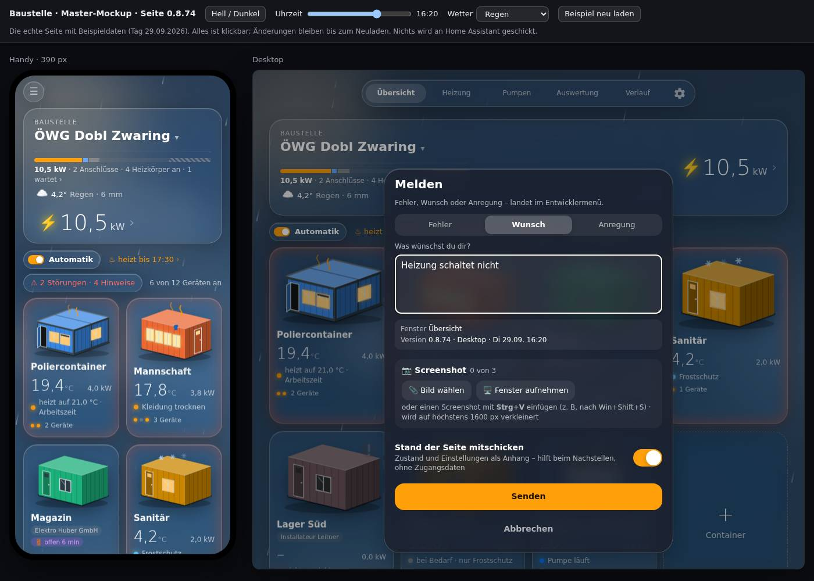

# Ausgangsprotokoll vor Lit (BSM-022, Stufe 0b.1)

Stand der Seite **vor** jeder Umstellung, festgehalten mit den neuen Tests (`docs/bauplan-lit.md` §6). Spätere Stufen
vergleichen sich damit: Was hier grün ist, muss grün bleiben; die bekannten Fehler werden in eigenen Stufen behoben und
dann aus `BEKANNT` in `tests/panel/browser/pruefen.mjs` gestrichen.

- **Revision:** Seite 0.8.74 (Commit `80bb5e9`, gebaut mit esbuild 0.28.2), Tests aus dem Commit dieser Stufe
- **Umgebung:** Raspberry Pi (HA OS, linux/arm64), Node v22.23.2, npm 10.9.1, happy-dom 20.14.5, puppeteer-core 24.8.2,
  Chromium 136.0.7103.113 headless (ohne Sandbox, ohne GPU)
- **Datum:** 06.10.2026

## Panel-Test (Node, happy-dom)

`node tests/panel/test_panel.js custom_components/baustelle/frontend/baustelle-panel.js tests/panel/struktur-0.7.json`

- Statt des selbstgebauten Mini-DOMs läuft die gebaute Seite in einem happy-dom-Fenster (`tests/panel/umgebung.js`): echtes
  Einhängen (`connectedCallback`), Klicks und Eingaben als DOM-Ereignisse durch die Listener der Seite, Hover als
  `pointermove`. Alle bisherigen Testfälle sind übernommen, keiner entfallen.
- **Ergebnis:** grün für das Beispiel (struktur-0.7) und die echte Antwort der Integration (struktur-echt); gleiche Zahl an
  WS-Aufrufen wie mit dem Mini-DOM (451 bzw. 345; ±1 je nach Laufzeit, weil die 5-Minuten-Statistik nach 60 s neu geholt wird).
- **Klicks:** Beispiel 683 auf Elemente der Seite, 340 über einen Ersatzknopf; echte Antwort 188 / 444. Ersatzknopf heißt:
  Der Testfall springt einer Ansicht voraus (z. B. `tab dev`, `container` außerhalb der Übersicht) oder das Element trägt
  weitere `data-`Attribute (Diagramm-Knöpfe). Liste je `data-act`: `BAUSTELLE_KLICKS=<datei>`.
- **Was das echte DOM zusätzlich prüft:** Die Sperre für Nicht-Admins (`gesperrt` braucht `el.matches`) griff im Mini-DOM
  nie und wird jetzt wirklich geprüft; WU-0012 (Regler tauscht nur den Datenteil) prüft jetzt echte Knoten.
- **Anpassungen am Test, nicht an der Seite:** esbuild schreibt oberste `const`/`class` als `var` (zwei Textprüfungen);
  der Serialisierer schreibt U+00A0 als `&nbsp;` (wird beim Lesen zurückgewandelt); Layoutmaße (FE-0013 Chipleiste) gibt
  der Test über `layout.setzen()` vor, weil happy-dom nicht layoutet.
- **Laufzeit:** etwa 90 s je Struktur statt 48 s (beide zusammen ≈ 2 min). Den Großteil verbraucht die Datums- und
  Zahlenformatierung der Seite (`lokal`, `de`); dazu kommen echtes Parsen von `innerHTML` und Speicherbereinigung.
  `ruhe()`-Schleifen bleiben, bis die Seite in 2b `updateComplete` hat.

## Browser-Test (Chromium 136)

`node tests/panel/browser/pruefen.mjs` (oder `npm --prefix custom_components/baustelle/frontend run test:browser`) –
Master-Mockup über einen lokalen HTTP-Server, keine Verbindung zu HA, Bedienung über Klick, Tastatur und Mausrad.
Testzugang im Mockup: `window.baustelleBeispiel` (Befehlsprotokoll, Verzögerung, veränderte Statistik, offene Abos).

| Fall | Ergebnis | Zeit |
|---|---|---|
| B1 Start | grün: Ansicht und Reiter sichtbar, Version 0.8.74 in Leiste und Seite, CSS-Himmel, keine Fehler | 2,7 s |
| Start mit WebGL-Ausfall | grün: `getContext` wirft → Seite läuft mit CSS-Himmel | 1,3 s |
| Start mit WebGL | auf dem Pi übersprungen (im Container kein WebGL: ohne `--disable-gpu` hängt der GPU-Prozess); läuft auf GitHub mit SwiftShader | – |
| B2 Eingabeschutz | grün: neue Strukturantwort verarbeitet, Text/Auswahl/Fokus/Knoten des Melde-Felds bleiben; nach dem Fokuswechsel neue Daten sichtbar, Entwurf bleibt | 4,9 s |
| B3 Scrollschutz | grün: Hauptansicht, Einblendung „Warnungen“, Chipleiste der Einstellungen (Handy) je ±1 px nach Update | 9,4 s |
| B4 Container live | neue 5-Minuten-Statistik: Kennzahlen neu, Position bleibt; offene Einblendung: Wert angekommen, Diagramm bleibt (Unterdrückung greift). **Befund:** die neue Statistik zeichnet die ganze Seite neu | 5,1 s |
| B5 Leistung | grün: Regler per Tastatur, Daten verzögert; Datenteil und Kopf neu, Regler/Fokus/Datenbereich/Scroll bleiben | 4,1 s |
| B6 Befehle/Rechte | grün: Admin – ein Klick, genau ein `baustelle/setzen`; Nicht-Admin – kein Auftrag, Hinweis „Nur ansehen“; Vor-Ort-Aktion (Warnung stumm) genau ein `baustelle/aktion` | 4,1 s |
| B7 Lebenszyklus | dasselbe Element 20 × aus/ein: Listener und Takt bleiben; neue Elemente: Takt und Abos wie bei einer Seite. **Zwei Befunde**, siehe unten | 8,2 s |

**Gesamt:** 9 Fälle, ≈ 40 s auf dem Pi (Budget ≤ 120 s).

## Bekannte Fehler (einzeln benannt)

| Befund | Ursache | Behebung |
|---|---|---|
| **B7 neue Elemente:** nach 20 neuen Seiten-Elementen 22 statt 2 `window`-Listener für `paste` und `location-changed` | `_aufbauen` meldet sie an, `disconnectedCallback` nicht ab (bauplan-lit §1) | 0b.2 (BSM-022.03) |
| **B7 Abos nach Wiedereinhängen** (neu gefunden): dasselbe Element aus- und wieder eingehängt → die zwei Wetter-Abos fehlen danach (4 → 2) | `disconnectedCallback` beendet die Abos; beim Einhängen holt `_laden` die Struktur, bricht aber bei unveränderter Antwort vor `_vorhersageAbo()` ab | 0b.2 (BSM-022.03) |
| **B4 ganze Seite neu** (neu gefunden): neue Statistik (Container-Diagramm) zeichnet die ganze Seite neu statt nur Diagramm und Kennzahlen | Antwort kommt über `_holen` → `_auffrischen` → `render()`; nur ohne Nachladen tauscht `_liveNeu` die zwei Stellen. Position bleibt dank Scroll-Wiederherstellung | Lit-Stufe 3d (Container) |

Ein Schutz, der hier grün ist, ist nur für die geprüften Fälle belegt; echte GPU-Darstellung und die Android-Tastatur
prüft die Abnahme auf S23 und Edge.
